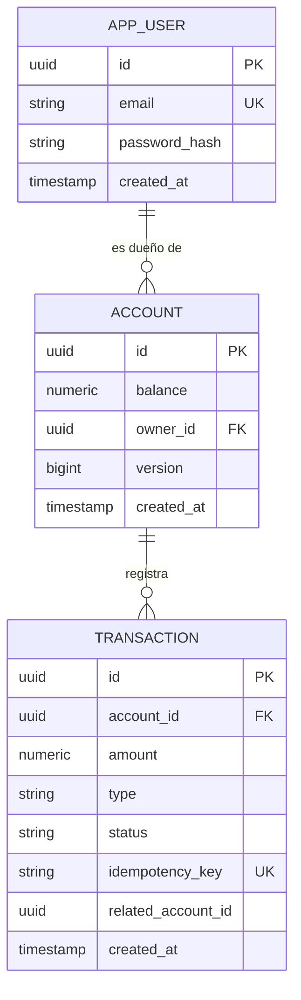
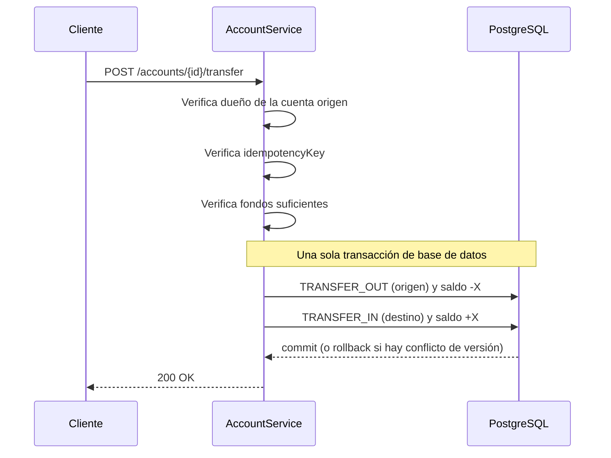

# ArgusPay Core

API REST de pagos construida con **Spring Boot 4 y Java 21**. Administra cuentas y saldos con depósitos, retiros y transferencias atómicas entre cuentas, y está pensada para ser consumida por un frontend, una app móvil o una integración externa.

El foco del proyecto es lo que separa un CRUD de un sistema de pagos: **idempotencia, atomicidad, control de concurrencia y seguridad**.

## Características

- **Cuentas y saldos** con precisión decimal (`NUMERIC(19,4)`).
- **Depósitos, retiros y transferencias** entre cuentas, con historial auditable de cada movimiento.
- **Idempotencia** (`idempotencyKey` en el body o header `Idempotency-Key`): un reintento de red no cobra dos veces.
- **Transferencias atómicas**: las dos piernas (`TRANSFER_OUT` / `TRANSFER_IN`) se guardan en una sola transacción.
- **Concurrencia segura** con locking optimista (`@Version`): dos operaciones simultáneas sobre el mismo saldo no pueden dejarlo inconsistente.
- **Autenticación JWT** (HS256) y **autorización por dueño de cuenta**.
- **Rate limiting** por IP en autenticación y por usuario en el resto de la API.
- **Errores unificados** en JSON (`timestamp`, `status`, `error`, `message`).
- **Documentación interactiva** con Swagger UI.
- **Tests de integración** con PostgreSQL real vía Testcontainers.

## Stack

| Tecnología | Uso |
|---|---|
| Java 21 | Lenguaje y runtime |
| Spring Boot 4.1.1 | Framework principal |
| Spring Web MVC | Controladores REST |
| Spring Security + JWT (Nimbus) | Autenticación y autorización |
| Spring Data JPA / Hibernate | Persistencia |
| PostgreSQL 16 | Base de datos |
| Flyway | Migraciones de esquema |
| Jakarta Validation | Validación de requests |
| springdoc-openapi | Swagger UI / OpenAPI |
| Testcontainers + JUnit 5 | Tests de integración |
| Docker Compose | PostgreSQL local |

## Arquitectura

Arquitectura en capas clásica: `controller → service → repository → entity`.


### Modelo de datos



### Flujo de una transferencia



## Cómo correrlo

Requisitos: **Java 21** y **Docker**.

```bash
docker compose up -d
./mvnw spring-boot:run
```

La API queda en `http://localhost:8080` y Swagger UI en `http://localhost:8080/swagger-ui.html`.

Configuración en `src/main/resources/application.properties`:

| Propiedad | Descripción |
|---|---|
| `arguspay.jwt.secret` | Secreto HS256 (mínimo 32 caracteres). En producción, definirlo por variable de entorno `ARGUSPAY_JWT_SECRET`. |
| `arguspay.jwt.expiration-minutes` | Duración del token (60 por defecto). |
| `arguspay.rate-limit.auth-per-minute` | Límite por IP en `/api/auth/**`. |
| `arguspay.rate-limit.api-per-minute` | Límite por usuario en el resto de la API. |

## Endpoints

| Método | Ruta | Descripción | Auth |
|---|---|---|---|
| POST | `/api/auth/register` | Registra un usuario y devuelve un token | No |
| POST | `/api/auth/login` | Inicia sesión y devuelve un token | No |
| POST | `/api/accounts` | Crea una cuenta con saldo 0 | Sí |
| GET | `/api/accounts/{id}/balance` | Consulta el saldo | Sí (dueño) |
| POST | `/api/accounts/{id}/deposit` | Deposita dinero | Sí (dueño) |
| POST | `/api/accounts/{id}/withdraw` | Retira dinero | Sí (dueño) |
| POST | `/api/accounts/{id}/transfer` | Transfiere a otra cuenta | Sí (dueño del origen) |
| GET | `/api/accounts/{id}/transactions` | Historial, más reciente primero | Sí (dueño) |

### Ejemplo rápido

```bash
curl -X POST http://localhost:8080/api/auth/register \
  -H "Content-Type: application/json" \
  -d '{"email": "demo@test.com", "password": "clave12345"}'
```

```bash
curl -X POST http://localhost:8080/api/accounts/{ID}/deposit \
  -H "Authorization: Bearer {TOKEN}" \
  -H "Content-Type: application/json" \
  -d '{"amount": 50.00, "idempotencyKey": "dep-001"}'
```

### Códigos de error

| Código | Cuándo |
|---|---|
| 400 | Request inválido (monto negativo, transferencia a la misma cuenta) |
| 401 | Sin token, token inválido o credenciales incorrectas |
| 403 | La cuenta pertenece a otro usuario |
| 404 | Cuenta inexistente |
| 409 | `idempotencyKey` repetida, email ya registrado o conflicto de concurrencia |
| 422 | Fondos insuficientes |
| 429 | Límite de peticiones superado (incluye header `Retry-After`) |

## Tests

```bash
./mvnw test
```

Requiere Docker: Testcontainers levanta un PostgreSQL 16 propio para los tests. Cubren autenticación, depósito, idempotencia, fondos insuficientes, transferencia con historial, aislamiento entre usuarios y **dos retiros simultáneos** (verifican que el saldo nunca queda negativo).

## Decisiones de diseño

- **Idempotencia antes que nada:** cada operación verifica su clave antes de tocar el saldo, y cada movimiento queda registrado en `transaction`.
- **Locking optimista en vez de locks de base de datos:** el campo `@Version` de `Account` detecta escrituras concurrentes y responde `409` sin bloquear filas.
- **Sin filtrar entidades JPA:** los controladores responden con DTOs.
- **Rate limiting en memoria:** simple y sin dependencias, válido para una sola instancia.

## Roadmap

- Rate limiting distribuido (Redis) para varias instancias.
- Refresh tokens y revocación.
- Paginación en el historial de movimientos.
- Dashboard web desacoplado (React/Vue).
## Dashboard web

Interfaz en React + Vite (blanco y negro, estilo flat) que consume esta API. Vive en un repositorio aparte: `arguspay-dashboard`.

- Login y registro con JWT
- Resumen: saldo total, cuentas y saldos, crear cuenta
- Movimientos: depositar, retirar, transferir e historial por cuenta

Para correrlo, con esta API en `localhost:8080`:

```bash
pnpm install
pnpm dev
```

El servidor de Vite usa un proxy de `/api` hacia `http://localhost:8080`, así que no hace falta configurar CORS.

## Configuración del secreto JWT

En desarrollo se usa un valor por defecto. En producción define la variable de entorno `ARGUSPAY_JWT_SECRET` (mínimo 32 caracteres):

```bash
export ARGUSPAY_JWT_SECRET="$(openssl rand -base64 48)"
```
