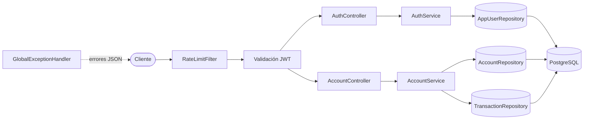
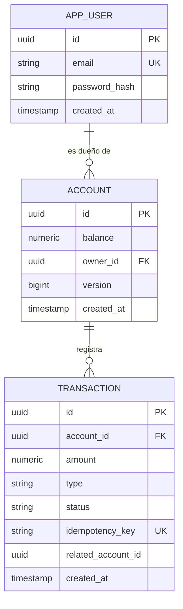
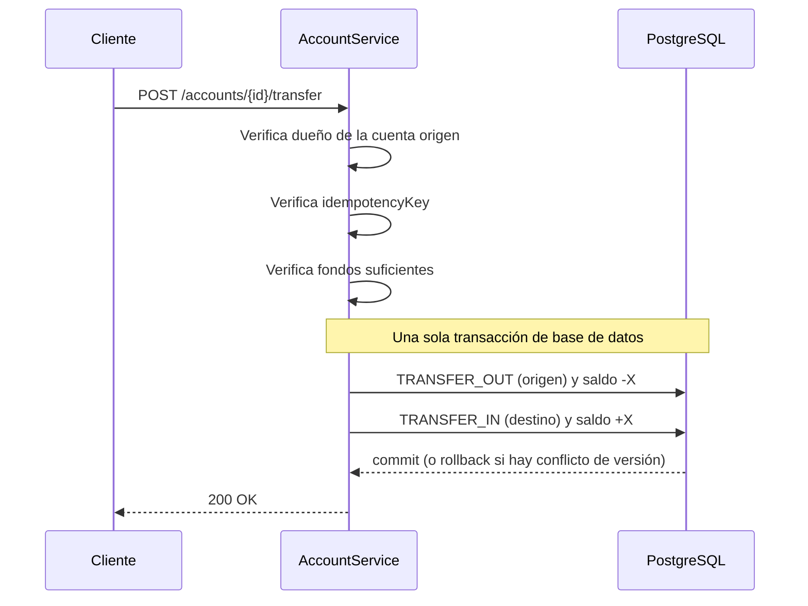

<div align="center">


### API REST de pagos con idempotencia, atomicidad y concurrencia segura

<br/>


<br/>

[](https://github.com/JUXCHXX/arguspay-dashboard)

<br/>

[Características](#características) · [Stack](#stack) · [Arquitectura](#arquitectura) · [Cómo correrlo](#cómo-correrlo) · [Endpoints](#endpoints) · [Tests](#tests) · [Dashboard](#dashboard-web)

</div>

---

ArgusPay Core administra **cuentas y saldos** con depósitos, retiros y transferencias atómicas entre cuentas. Es un servicio pensado para ser consumido por un frontend, una app móvil o una integración externa.

El foco del proyecto es lo que separa un CRUD de un sistema de pagos: **idempotencia, atomicidad, control de concurrencia y seguridad**.

## Características

| | Característica | Detalle |
|---|---|---|
| 💰 | **Cuentas y saldos** | Precisión decimal con `NUMERIC(19,4)` |
| 🔁 | **Depósitos, retiros y transferencias** | Historial auditable de cada movimiento |
| 🛡️ | **Idempotencia** | `idempotencyKey` en el body o header `Idempotency-Key`: un reintento de red no cobra dos veces |
| ⚛️ | **Transferencias atómicas** | Las dos piernas (`TRANSFER_OUT` / `TRANSFER_IN`) se guardan en una sola transacción |
| 🔒 | **Concurrencia segura** | Locking optimista (`@Version`): dos operaciones simultáneas sobre el mismo saldo no lo dejan inconsistente |
| 🔑 | **Autenticación JWT** | HS256, con autorización por dueño de cuenta |
| 🚦 | **Rate limiting** | Por IP en autenticación y por usuario en el resto de la API |
| 📋 | **Errores unificados** | JSON con `timestamp`, `status`, `error` y `message` |
| 📖 | **Documentación interactiva** | Swagger UI con botón *Authorize* |
| 🧪 | **Tests de integración** | PostgreSQL real vía Testcontainers |

## Stack

| Tecnología | Uso |
|---|---|
|  | Lenguaje y runtime |
|  | Framework principal y Spring Web MVC |
|   | Autenticación y autorización |
|  | Persistencia con Hibernate |
|  | Base de datos |
|  | Migraciones de esquema |
|  | Validación de requests |
|  | Swagger UI y OpenAPI |
|   | Tests de integración |
|  | PostgreSQL local |
|  | Build |

## Arquitectura

Arquitectura en capas clásica: `controller → service → repository → entity`.



### Modelo de datos



### Flujo de una transferencia



### Estructura del proyecto

```
arguspay-core/
├── src/main/java/com/arguspay/core/
│   ├── config/        SecurityConfig, RateLimitFilter, OpenApiConfig
│   ├── controller/    AuthController, AccountController
│   ├── service/       AuthService, AccountService, JwtService
│   ├── repository/    AppUser, Account y Transaction repositories
│   ├── entity/        AppUser, Account, Transaction + enums
│   ├── dto/           Requests y responses
│   └── exception/     GlobalExceptionHandler y excepciones de dominio
├── src/main/resources/db/migration/   V1, V2 y V3 (Flyway)
└── src/test/java/                     Tests de integración (Testcontainers)
```

## Cómo correrlo

Requisitos: **Java 21** y **Docker**.

```bash
docker compose up -d
./mvnw spring-boot:run
```

La API queda en `http://localhost:8080` y Swagger UI en `http://localhost:8080/swagger-ui.html`.

### Configuración

Se define en `src/main/resources/application.properties`:

| Propiedad | Descripción |
|---|---|
| `arguspay.jwt.secret` | Secreto HS256 (mínimo 32 caracteres). Se lee de la variable de entorno `ARGUSPAY_JWT_SECRET`; en desarrollo tiene un valor por defecto |
| `arguspay.jwt.expiration-minutes` | Duración del token (60 por defecto) |
| `arguspay.rate-limit.auth-per-minute` | Límite por IP en `/api/auth/**` |
| `arguspay.rate-limit.api-per-minute` | Límite por usuario en el resto de la API |

En producción, define un secreto propio:

```bash
export ARGUSPAY_JWT_SECRET="$(openssl rand -base64 48)"
```

## Endpoints

| Método | Ruta | Descripción | Auth |
|---|---|---|---|
| `POST` | `/api/auth/register` | Registra un usuario y devuelve un token | No |
| `POST` | `/api/auth/login` | Inicia sesión y devuelve un token | No |
| `GET` | `/api/accounts` | Lista las cuentas del usuario | Sí |
| `POST` | `/api/accounts` | Crea una cuenta con saldo 0 | Sí |
| `GET` | `/api/accounts/{id}/balance` | Consulta el saldo | Sí (dueño) |
| `POST` | `/api/accounts/{id}/deposit` | Deposita dinero | Sí (dueño) |
| `POST` | `/api/accounts/{id}/withdraw` | Retira dinero | Sí (dueño) |
| `POST` | `/api/accounts/{id}/transfer` | Transfiere a otra cuenta | Sí (dueño del origen) |
| `GET` | `/api/accounts/{id}/transactions` | Historial, más reciente primero | Sí (dueño) |

<details>
<summary><b>Ver ejemplos con curl</b></summary>

<br/>

```bash
curl -X POST http://localhost:8080/api/auth/register \
  -H "Content-Type: application/json" \
  -d '{"email": "demo@test.com", "password": "clave12345"}'
```

```bash
curl -X POST http://localhost:8080/api/accounts/{ID}/deposit \
  -H "Authorization: Bearer {TOKEN}" \
  -H "Content-Type: application/json" \
  -d '{"amount": 50.00, "idempotencyKey": "dep-001"}'
```

</details>

### Códigos de error

| Código | Cuándo |
|---|---|
| `400` | Request inválido (monto negativo, transferencia a la misma cuenta) |
| `401` | Sin token, token inválido o credenciales incorrectas |
| `403` | La cuenta pertenece a otro usuario |
| `404` | Cuenta inexistente |
| `409` | `idempotencyKey` repetida, email ya registrado o conflicto de concurrencia |
| `422` | Fondos insuficientes |
| `429` | Límite de peticiones superado (incluye header `Retry-After`) |

## Tests

```bash
./mvnw test
```

Requiere Docker: Testcontainers levanta un PostgreSQL 16 propio para los tests. Son **8 pruebas** que cubren autenticación, depósito, idempotencia, fondos insuficientes, transferencia con historial, aislamiento entre usuarios y **dos retiros simultáneos** (verifican que el saldo nunca queda negativo).

## Decisiones de diseño

- **Idempotencia antes que nada:** cada operación verifica su clave antes de tocar el saldo, y cada movimiento queda registrado en `transaction`.
- **Locking optimista en vez de locks de base de datos:** el campo `@Version` de `Account` detecta escrituras concurrentes y responde `409` sin bloquear filas.
- **Sin filtrar entidades JPA:** los controladores responden con DTOs.
- **Rate limiting en memoria:** simple y sin dependencias, válido para una sola instancia.

## Dashboard web

Interfaz en **React + Vite** (blanco y negro, estilo flat) que consume esta API. Vive en un repositorio aparte.

[](https://github.com/JUXCHXX/arguspay-dashboard)

- Login y registro con JWT
- **Resumen:** saldo total, cuentas y saldos, crear cuenta
- **Movimientos:** depositar, retirar, transferir e historial por cuenta

Para correrlo, con esta API en `localhost:8080`:

```bash
pnpm install
pnpm dev
```

El servidor de Vite usa un proxy de `/api` hacia `http://localhost:8080`, así que no hace falta configurar CORS.

## Roadmap

- [x] Dashboard web desacoplado (React + Vite)
- [ ] Alias por cuenta y transferencias por correo
- [ ] Rate limiting distribuido (Redis) para varias instancias
- [ ] Refresh tokens y revocación
- [ ] Paginación en el historial de movimientos
- [ ] Despliegue

---

<div align="center">

Hecho por [JUXCHXX](https://github.com/JUXCHXX)

</div>